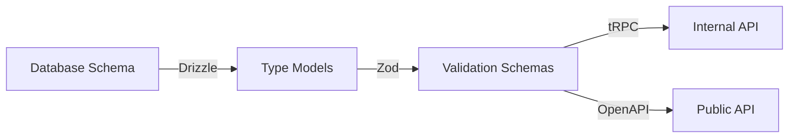

# Introduction
Type safety is crucial for maintaining large applications. In this post, I'll walk through how we've built a fully type-safe system from the database schema all the way to the public API endpoints. We'll see how types flow through each layer of the application, ensuring consistency and catching errors at compile time.

## The Type Safety Chain
Our type safety implementation follows this chain:



## 1. Database Schema Definition
We start with Drizzle ORM to define our database schema with full type safety:

```typescript
import { relations, sql } from 'drizzle-orm';
import {
  integer,
  pgTable,
  timestamp,
  varchar,
  vector,
} from 'drizzle-orm/pg-core';
import { createInsertSchema, createSelectSchema } from 'drizzle-zod';

export const candidate = pgTable('candidate', {
  id: integer('id').primaryKey().generatedAlwaysAsIdentity(),
  name: varchar('name', { length: 255 }).notNull(),
  email: varchar('email', { length: 255 }),
  atsId: varchar('ats_id', { length: 255 }).notNull(),
  organisationId: integer('organisation_id')
    .notNull()
    .references(() => organisation.id),
  // ... other fields
});

// Automatically generate Zod schemas from the table definition
export const insertCandidateSchema = createInsertSchema(candidate);
export const selectCandidateSchema = createSelectSchema(candidate);
```

## 2. Type Models and Zod Schemas
We then define our core types and validation schemas:

```typescript
import { z } from 'zod';
import { insertCandidateSchema } from '~/server/db/schema';

export enum CandidateStatus {
  Pending = 'PENDING',
  RejectedBeforeInterview = 'REJECTED_BEFORE_INTERVIEW',
  // ... other statuses
}

export const createCandidateSchema = z.object({
  name: insertCandidateSchema.shape.name,
  atsId: insertCandidateSchema.shape.atsId,
  email: insertCandidateSchema.shape.email,
  status: z.nativeEnum(CandidateStatus),
  // ... other fields
});

// Extended schema for public API
export const createCandidateWithOrganisationSchema = 
  createCandidateSchema.extend({
    organisationId: z.string(),
  });
```

These schemas are then used to generate TypeScript types:

```typescript
import { z } from 'zod';
import type {
  selectCandidateSchema,
  insertCandidateSchema,
} from '~/server/db/schema';
import type { createCandidateWithOrganisationSchema } from '~/schemas';

export type NewCandidate = z.infer<typeof insertCandidateSchema>;
export type Candidate = z.infer<typeof selectCandidateSchema>;
export type CandidateWithOrganisation = z.infer<
  typeof createCandidateWithOrganisationSchema
>;
```

## 3. Internal API with tRPC
Our internal API uses tRPC for full type safety between the client and server:

```typescript
import { createTRPCRouter, publicProcedure } from '~/server/api/trpc';
import { selectCandidateSchema } from '~/server/db/schema';

export const candidateRouter = createTRPCRouter({
  getByAtsId: publicProcedure
    .input(
      selectCandidateSchema
        .pick({
          atsId: true,
          companyId: true,
          email: true,
        })
        .extend({
          organisationId: z.string(),
        }),
    )
    .query(async ({ ctx, input }) => {
      const data = await ctx.db.query.candidate.findFirst({
        where: and(
          eq(candidate.atsId, input.atsId),
          eq(candidate.organisationId, organisationInDb.id),
          // ... other conditions
        ),
      });
      return data;
    }),
});
```

## 4. Public API with OpenAPI
Finally, our public API uses Hono with OpenAPI for type-safe external endpoints:

```typescript
import { createRoute, z } from '@hono/zod-openapi';
import { createCandidateSchema } from '~/schemas';

export const create = createRoute({
  tags: ['Candidate'],
  method: 'post',
  path: '/peoplebank/candidate',
  security: [{ Bearer: [] }],
  request: {
    body: jsonContent(
      z.object({
        candidates: z.array(createCandidateSchema).openapi('candidates'),
      }),
      'Candidate',
    ),
  },
  responses: {
    [HttpStatusCodes.OK]: jsonContent(
      createMessageObjectSchema('OK'), 
      'OK'
    ),
    // ... other responses
  },
});
```

## Type Safety Benefits
1. Automatic Type Inference
The system automatically infers types throughout the stack:
- Database operations are fully typed
- API inputs and outputs are validated at runtime and compile time
- Client-side code gets full type information

2. Schema Reuse
We reuse schemas across different layers:
- Database schemas generate Zod validators
- Zod validators generate TypeScript types
- OpenAPI schemas are generated from Zod schemas

3. Compile-Time Error Detection
The type system catches many potential errors:
- Missing or incorrect field names
- Type mismatches
- Incomplete implementations
- Invalid enum values

## Advanced Type Safety Features

1. Shadow Tables for Sync State
We maintain type safety even in our sync system:

```typescript
export const candidateShadow = pgTable('candidate_shadow', {
  id: integer('id').primaryKey().generatedAlwaysAsIdentity(),
  candidateId: integer('candidate_id').references(() => candidate.id, {
    onDelete: 'cascade',
  }),
  // ... mirror of candidate fields
  lastSyncedAt: timestamp('last_synced_at', { withTimezone: true })
    .notNull()
    .$onUpdate(() => sql`CURRENT_TIMESTAMP`),
  checksum: varchar('checksum', { length: 64 }).notNull(),
});

export const candidateShadowRelations = relations(
  candidateShadow,
  ({ one }) => ({
    candidate: one(candidate, {
      fields: [candidateShadow.candidateId],
      references: [candidate.id],
    }),
  }),
);
```

# Conclusion

Building a fully type-safe system requires careful planning and the right tools:
- Database Layer: Drizzle ORM for type-safe database operations
- Validation Layer: Zod for runtime validation and type generation
- Internal API: tRPC for end-to-end type safety
- Public API: Hono with OpenAPI for type-safe external endpoints
  
The benefits are substantial:
- Fewer runtime errors
- WAY Better developer experience
- Easier refactoring
- Self-documenting code
- Confident deployments

While it requires more upfront work to set up, the long-term benefits of full type safety far outweigh the initial investment.
