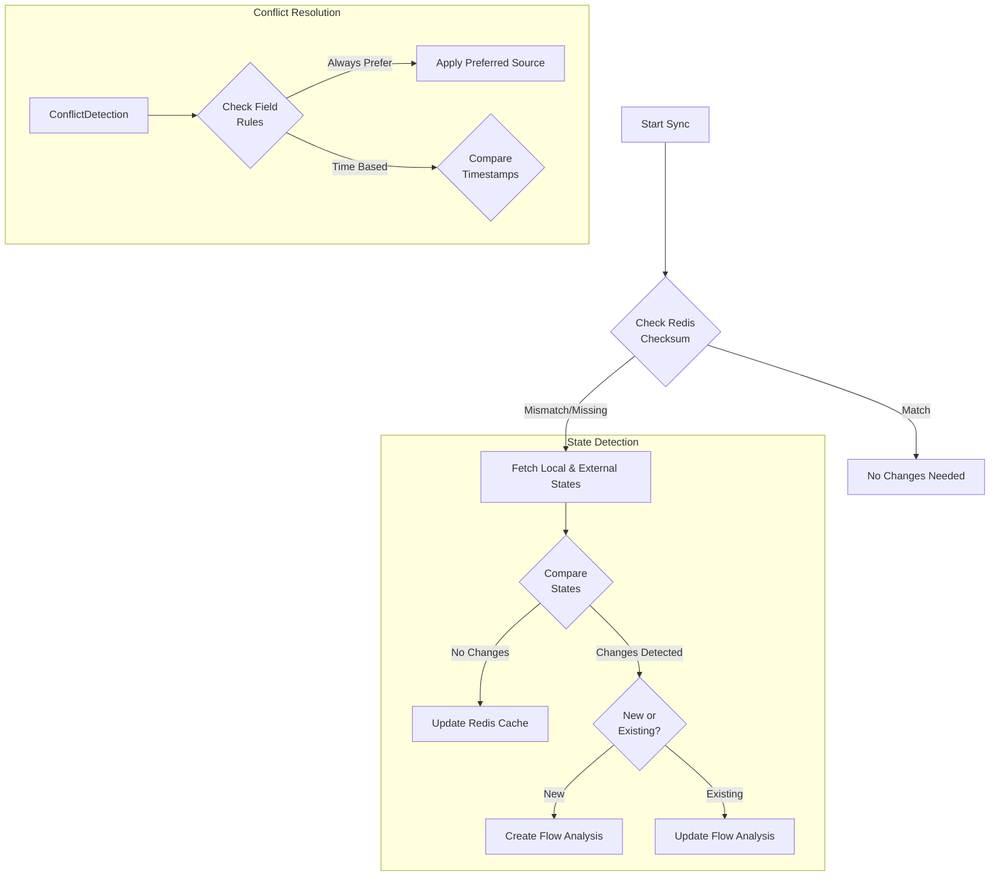

# Introduction
In this post, I'll walk through the implementation of a data synchronization service that handles bidirectional updates between an external ATS (Applicant Tracking System) and our local system. The service is designed to handle complex scenarios like conflict resolution, state management, and data integrity verification.
System Overview
Here's a high-level view of our sync process:



## Core Components
### 1. State Management with Shadow Tables

We use a shadow table pattern to track the last known state of synchronized data. This helps us detect changes and resolve conflicts:

```typescript
export function calculateCombinedChecksum(
  data: CandidateWithOrganisation | JobSyncRelevantData,
  type: 'candidate' | 'job' = 'candidate',
): string {
  const relevantData: SyncRelevantData =
    type === 'candidate'
      ? {
          atsId: data.atsId,
          organisationId: data.organisationId,
          email: (data as CandidateWithOrganisation).email,
          // ... other fields
        }
      : data;

  // Sort keys for consistent checksum
  const sortedData = Object.keys(relevantData)
    .sort()
    .reduce<Record<string, string | number | null | undefined>>((obj, key) => {
      obj[key] = relevantData[key as keyof SyncRelevantData];
      return obj;
    }, {});

  return createHash('sha256')
    .update(JSON.stringify(sortedData))
    .digest('hex');
}
```

### 2. Change Detection
The system categorizes incoming data into new records or updates:

```typescript
export async function categorise(
  payloads: CandidateWithOrganisation[],
): Promise<CandidateGroups> {
  const groups: CandidateGroups = {
    toCreate: [],
    toUpdate: [],
  };

  for (const payload of payloads) {
    const exists = await api.candidate.getByAtsId({
      atsId: payload.atsId,
      organisationId: payload.organisationId,
      companyId: payload.companyId,
      email: payload.email ?? '',
    });

    if (exists) {
      groups.toUpdate.push(payload);
    } else {
      groups.toCreate.push(payload);
    }
  }

  return groups;
}
```

### 3. Conflict Resolution
One of the most complex aspects is handling conflicts between local and external changes. We implement a sophisticated priority system for status updates:

```typescript
export const statusPriority = {
  [CandidateStatus.Pending]: 0,
  [CandidateStatus.RejectedBeforeInterview]: 1,
  [CandidateStatus.InvitedToInterview]: 2,
  [CandidateStatus.RejectedAfterInterview]: 3,
  [CandidateStatus.Offered]: 4,
} as const;
```

This allows us to make intelligent decisions about which status changes should take precedence:

```typescript
if (!compareChecksums(shadowRecord.checksum, externalChecksum) && 
    jobApplication.status) {
  const externalPriority = statusPriority[externalData.status];
  const localPriority = statusPriority[jobApplication.status];

  if (externalPriority === statusPriority.REJECTED_AFTER_INTERVIEW) {
    await api.jobCvs.updateStatus({
      candidateId: localCandidate.id,
      jobAtsId: externalData.jobId,
      jobCvId: jobApplication.id,
      status: externalData.status,
      disqualificationReason: 'Failed interview',
      organisationId: localCandidate.organisationId,
    });
  } else if (
    externalPriority < statusPriority.REJECTED_AFTER_INTERVIEW &&
    localPriority < externalPriority
  ) {
    // Update to higher priority status
    await api.jobCvs.updateStatus({
      // ... update details
    });
  }
}
```

### 4. Performance Optimization
We implement several performance optimizations:
1. Checksum-based Change Detection: Quick comparison of states without deep object comparison
Batch Processing: Handling multiple records in a single sync operation
Performance Monitoring:

```typescript
export async function syncCandidateChanges(
  externalData: CandidateWithOrganisation,
): Promise<SyncResult> {
  const startTime = performance.now();
  
  // Sync logic here...

  const endTime = performance.now();
  console.info(
    `Sync candidate changes took ${String((endTime - startTime).toFixed(4))}ms`,
  );

  return {
    success: true,
    updated: true,
  };
}
```

5. Comprehensive Testing
The system includes extensive tests to ensure reliability and serve as documentation:

```typescript
describe('If the external data matches our current shadow table', () => {
  describe('If the external data matches the local data', () => {
    it('Should sync the shadow candidate data with the current local data.', async () => {
      const mockShadowRecord = { ...baseShadowCandidateData };
      const mockExternalData = { ...baseExternalCandidateData };

      vi.mocked(api.candidateShadow.getByAtsId).mockResolvedValue(
        mockShadowRecord,
      );
      vi.mocked(api.candidate.getByAtsId).mockResolvedValue(
        baseLocalCandidateData,
      );

      await syncCandidateChanges(mockExternalData);

      expect(api.candidateShadow.update).toHaveBeenCalledWith({
        ...mockShadowRecord,
        lastSyncedAt: new Date(),
      });
    });
  });
});
```

## Key Features
1. Bidirectional Sync: Handles updates from both external ATS and local system
2. Conflict Resolution: Smart handling of conflicting changes based on business rules
3 Data Integrity: Checksum-based verification of sync states
4. Performance Optimization: Efficient change detection and batch processing
5. Error Handling: Comprehensive error handling and recovery mechanisms
6. TDD / Testability: Extensive test coverage for all sync scenarios

## Challenges and Solutions
1. Race Conditions
To prevent race conditions, we use a shadow table pattern that tracks the last known state of synchronized data. This allows us to detect concurrent modifications and resolve them appropriately.

2. Data Consistency
We maintain data consistency through:
Checksum verification
Shadow table state tracking
Atomic updates where possible
Clear conflict resolution rules

3. Error Recovery
The system includes several error recovery mechanisms:
- Detailed error logging
- Retry logic for failed operations
- Manual review triggers for unresolvable conflicts

## Conclusion
Building a robust data synchronization service requires careful consideration of many factors:
State management
Conflict resolution
Performance optimization
Error handling
Testing

The implementation shown here provides a reliable foundation for bidirectional data synchronization while maintaining data integrity and handling complex business rules.
The complete source code demonstrates how to implement these concepts in a production environment, with proper error handling, testing, and monitoring in place.
